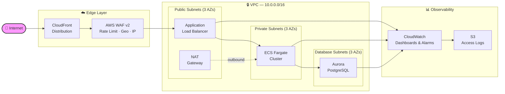
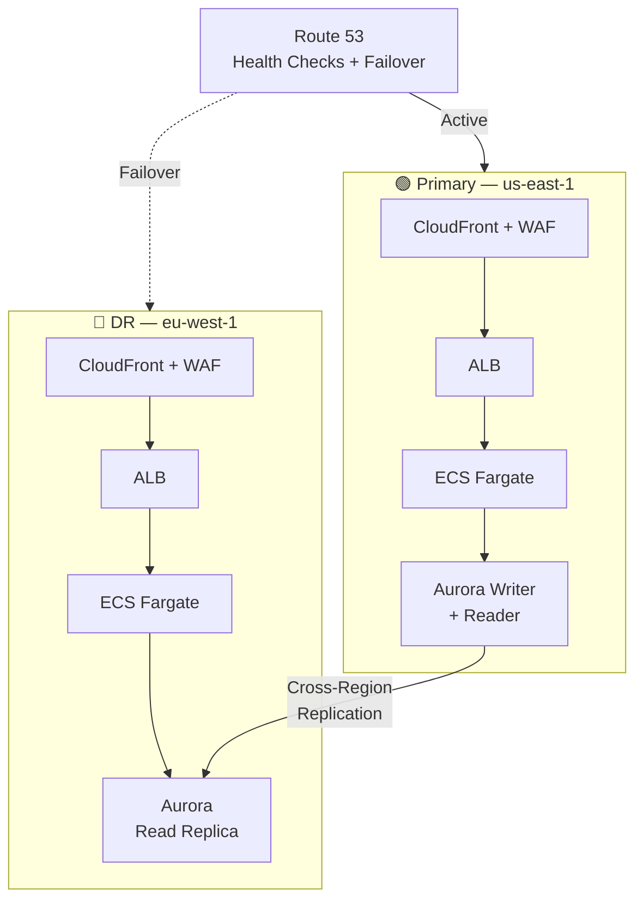
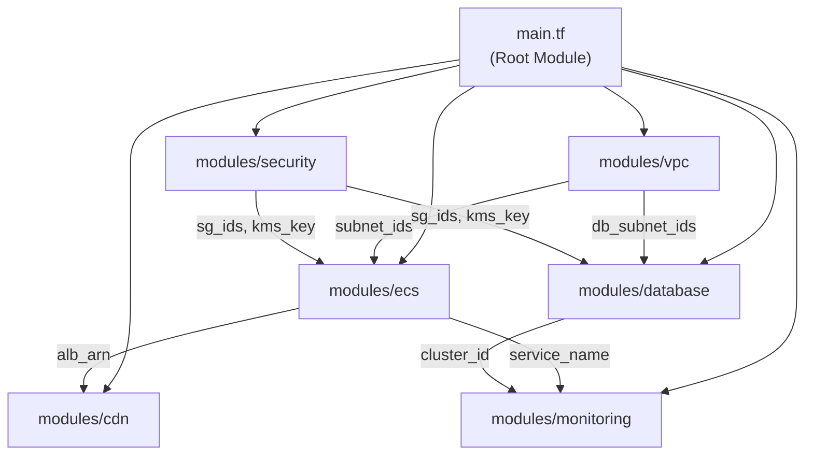
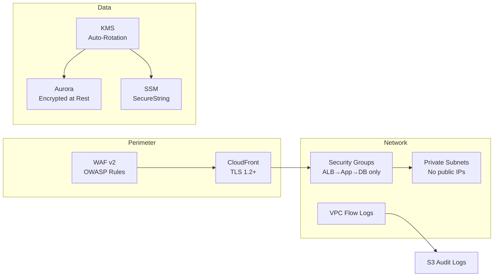
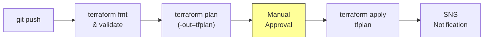

<div align="center">

# 🏗️ CloudForge — Multi-Region Infrastructure Framework


A production-grade, multi-region AWS infrastructure framework built with modular Terraform that deploys a fully wired stack — VPC networking, ECS Fargate compute, Aurora PostgreSQL databases, CloudFront with WAF edge protection, and CloudWatch observability — across primary and disaster-recovery regions, following AWS Well-Architected principles for security, reliability, performance efficiency, and cost optimization.

</div>

---

## 🏗️ Architecture



### Multi-Region Failover



---

## ✨ Features

- ✅ **Multi-Region HA/DR** — Primary + disaster recovery with Route 53 automated failover
- ✅ **Zero-Downtime Deploys** — ECS Fargate with rolling and blue/green deployment support
- ✅ **Auto Scaling** — CPU/memory-based scaling from 2 to 10 tasks
- ✅ **Aurora PostgreSQL** — Encrypted, multi-AZ with cross-region read replicas
- ✅ **Edge Security** — CloudFront + WAF v2 with rate limiting, geo-blocking, IP allowlists
- ✅ **Full Observability** — CloudWatch dashboards, metric alarms, SNS alerting, S3 centralized logs
- ✅ **Encryption Everywhere** — KMS with auto-rotation, TLS termination, encrypted storage at rest
- ✅ **Least-Privilege IAM** — Scoped roles per service, zero wildcard policies
- ✅ **Remote State** — S3 backend + DynamoDB locking with versioning and encryption
- ✅ **CI/CD Ready** — GitHub Actions pipeline: lint → plan → approve → apply

---

## 📦 Module Structure

| Module | Description | Key Resources |
|--------|-------------|---------------|
| **`modules/vpc`** | Multi-AZ networking foundation | VPC, public/private/database subnets, NAT Gateways, VPC Flow Logs |
| **`modules/ecs`** | Containerized compute layer | Fargate cluster, ALB, target groups, auto-scaling, ECR repository |
| **`modules/database`** | Managed relational database | Aurora PostgreSQL cluster, writer + reader instances, parameter groups |
| **`modules/cdn`** | Edge distribution & DNS | CloudFront distribution, WAF WebACL, Route 53 records, ACM certs |
| **`modules/monitoring`** | Observability & alerting | CloudWatch dashboards, metric alarms, log groups, SNS topics |
| **`modules/security`** | Encryption & access control | KMS keys, security groups, SSM parameters, IAM roles |



---

## 🚀 Quick Start

```bash
# Clone
git clone https://github.com/hunterspence/cloudforge.git
cd cloudforge

# Configure
cp terraform.tfvars.example terraform.tfvars
# ✏️  Edit terraform.tfvars with your domain, regions, and preferences

# Deploy
terraform init               # Download providers & modules
terraform plan -out=tfplan   # Preview all changes
terraform apply tfplan       # Build everything
```

---

## 💰 Cost Estimate

Monthly estimates for `us-east-1` (USD):

| Service | Small | Medium | Large |
|---------|------:|-------:|------:|
| **NAT Gateway** (per AZ) | $32 | $97 | $97 |
| **ALB** | $22 | $22 | $45 |
| **ECS Fargate** (tasks) | $15 ×1 | $29 ×2 | $58 ×4 |
| **Aurora PostgreSQL** | $60 | $175 | $350 |
| **CloudFront** | $1 | $5 | $50 |
| **WAF WebACL** | $6 | $11 | $21 |
| **CloudWatch** | $3 | $10 | $30 |
| **S3 Logs** | $1 | $3 | $10 |
| | | | |
| **Estimated Total** | **~$140/mo** | **~$350/mo** | **~$660/mo** |

> 💡 Costs scale with traffic and instance sizes. Run `terraform plan` to see exact resource counts.

---

## 🔐 Security



| Layer | Controls |
|-------|----------|
| **Edge** | WAF rate limiting, geo-blocking, IP allowlists, managed OWASP rule groups |
| **Transport** | TLS 1.2+ everywhere, ACM auto-renewing certificates, HTTPS-only redirect |
| **Network** | Private subnets for compute & DB, minimal-ingress security groups, VPC Flow Logs |
| **Data** | KMS encryption at rest with auto-rotation, SSM SecureString for secrets |
| **Identity** | Scoped IAM roles with least-privilege policies, no long-lived credentials |
| **Audit** | CloudTrail, VPC Flow Logs, CloudWatch log retention, S3 access logs |

---

## 🔄 CI/CD Pipeline



The included GitHub Actions workflow ([`ci-cd/github-actions.yml`](ci-cd/github-actions.yml)) runs on every push:

1. **Lint** — `terraform fmt -check` and `terraform validate`
2. **Plan** — Generates execution plan, posts diff as PR comment
3. **Apply** — Requires manual approval gate, then applies to AWS
4. **Notify** — Posts deployment status to SNS / Slack

---

## 🧹 Teardown

```bash
# Interactive (prompts for confirmation)
terraform destroy

# Non-interactive
terraform destroy -auto-approve
```

> ⚠️ **This deletes ALL infrastructure including databases.** Export snapshots and backups before destroying.

---

<div align="center">

**[📁 Project Structure](.)** · **[📖 Variables](variables.tf)** · **[📤 Outputs](outputs.tf)**

Built by [Hunter Spence](https://github.com/hunterspence) · Cloud Solutions Architect

MIT License

</div>
