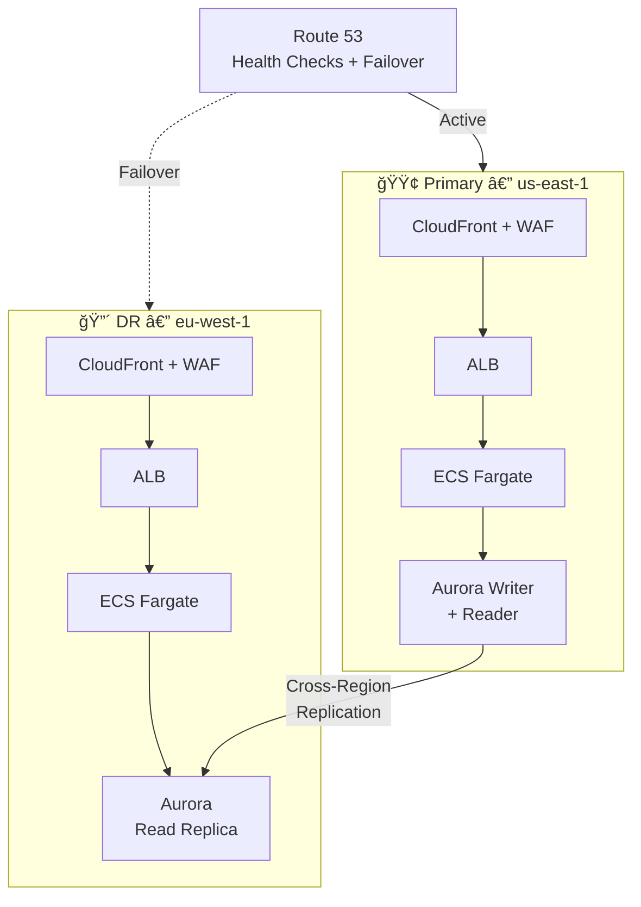
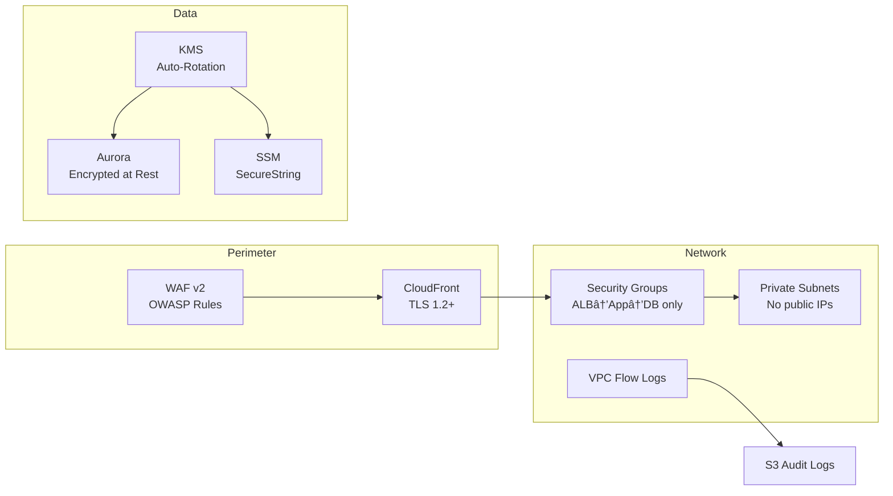

<div align="center">

# ☁️ CloudForge

**Multi-Region AWS Infrastructure Framework**


A production-grade, multi-region AWS infrastructure framework built with modular Terraform. Deploys a fully wired stack—VPC, ECS Fargate, Aurora PostgreSQL, CloudFront with WAF, and CloudWatch observability—across primary and disaster-recovery regions, following AWS Well-Architected principles for security, reliability, and cost optimization.

</div>

---

## 🏗️ Architecture

```mermaid
graph LR
    Users([👤 Internet]):::external

    subgraph Edge ["☁️ Edge Layer"]
        CF["CloudFront\nDistribution"]
        WAF["AWS WAF v2\nRate Limit · Geo · IP"]
        R53["Route 53\nLatency Routing"]
        ACM["ACM TLS\nCertificate"]
    end

    subgraph VPC ["🔒 VPC — 10.0.0.0/16"]
        subgraph Public ["Public Subnets (3 AZs)"]
            ALB["Application\nLoad Balancer"]
            NAT["NAT\nGateway"]
        end
        subgraph Private ["Private Subnets (3 AZs)"]
            ECS["ECS Fargate\nCluster"]
            AS["Auto Scaling\n2 → 10 tasks"]
            ECR["ECR\nRegistry"]
        end
        subgraph DB ["Database Subnets (3 AZs)"]
            Aurora["Aurora\nPostgreSQL"]
            Replica["Read\nReplica"]
        end
    end

    subgraph Observe ["📊 Observability"]
        CW["CloudWatch\nDashboards & Alarms"]
        SNS["SNS\nAlerts"]
        S3["S3\nLogs"]
    end

    Users --> R53 --> CF
    CF --> WAF --> ALB
    ALB --> ECS
    ECS --> AS
    ECS --> Aurora
    Aurora --> Replica
    ECS --> CW
    ALB --> CW
    Aurora --> CW
    CW --> SNS
    CW --> S3
    NAT -.-> ECS
    ECR -.-> ECS
    ACM -.-> CF

    classDef external fill:#f9f,stroke:#333,stroke-width:2px
```



### Multi-Region Failover



---

## ✨ Features

- ✅ **Multi-Region HA/DR** — Primary + disaster recovery with automated failover
- ✅ **Zero-Downtime Deploys** — ECS Fargate with blue/green deployment support
- ✅ **Auto Scaling** — CPU/memory-based scaling from 2 to 10 tasks
- ✅ **Aurora PostgreSQL** — Encrypted, multi-AZ with cross-region read replicas
- ✅ **Edge Security** — CloudFront + WAF v2 with rate limiting, geo-blocking, IP rules
- ✅ **Full Observability** — CloudWatch dashboards, metric alarms, SNS alerting, centralized logs
- ✅ **Encryption Everywhere** — KMS keys with auto-rotation, TLS termination, encrypted storage
- ✅ **Least-Privilege IAM** — Scoped roles for every service, no wildcards
- ✅ **Remote State** — S3 + DynamoDB locking with versioning and encryption
- ✅ **CI/CD Ready** — GitHub Actions pipeline: lint → plan → apply

---

## 📦 Module Structure

| Module | Description | Key Resources |
|--------|-------------|---------------|
| **`vpc`** | Multi-AZ networking foundation | VPC, public/private/database subnets, NAT Gateways, VPC Flow Logs, route tables |
| **`ecs`** | Containerized compute layer | Fargate cluster, ALB, target groups, auto-scaling policies, ECR repository |
| **`database`** | Managed relational database | Aurora PostgreSQL cluster, writer + reader instances, subnet groups, parameter groups |
| **`cdn`** | Edge distribution & DNS | CloudFront distribution, WAF WebACL, Route 53 records, ACM certificates |
| **`monitoring`** | Observability & alerting | CloudWatch dashboards, metric alarms, log groups, SNS topics |
| **`security`** | Encryption & access control | KMS keys, security groups, SSM parameters, IAM roles |


---

## 🚀 Quick Start

```bash
# Clone
git clone https://github.com/hunterspence/cloudforge.git
cd cloudforge

# Configure
cp terraform.tfvars.example terraform.tfvars
# ✏️  Edit terraform.tfvars with your domain, regions, and preferences

# Deploy
terraform init          # Download providers & modules
terraform plan -out=tfplan   # Preview changes
terraform apply tfplan       # Build everything
```

| Variable | Description | Default |
|----------|-------------|---------|
| `project_name` | Resource name prefix | `cloudforge` |
| `environment` | Environment tag | `production` |
| `primary_region` | Primary AWS region | `us-east-1` |
| `dr_region` | DR region | `eu-west-1` |
| `domain_name` | Route 53 domain | — |
| `vpc_cidr` | VPC CIDR block | `10.0.0.0/16` |
| `db_instance_class` | Aurora instance size | `db.r6g.large` |

See [`variables.tf`](variables.tf) for the full list.

---

## 💰 Cost Estimate

Monthly estimates for `us-east-1` (USD):

| Service | Small | Medium | Large |
|---------|------:|-------:|------:|
| **NAT Gateway** (per AZ) | $32 | $97 | $97 |
| **ALB** | $22 | $22 | $45 |
| **ECS Fargate** (tasks) | $15 ×1 | $29 ×2 | $58 ×4 |
| **Aurora PostgreSQL** | $60 | $175 | $350 |
| **CloudFront** | $1 | $5 | $50 |
| **WAF WebACL** | $6 | $11 | $21 |
| **CloudWatch** | $3 | $10 | $30 |
| **S3 Logs** | $1 | $3 | $10 |
| | | | |
| **Estimated Total** | **~$140/mo** | **~$350/mo** | **~$660/mo** |

> 💡 Costs scale with traffic and instance sizes. Run `terraform plan` to see exact resource counts.

---

## 🔐 Security



| Layer | Controls |
|-------|----------|
| **Edge** | WAF rate limiting, geo-blocking, IP allowlists, managed rule groups |
| **Transport** | TLS 1.2+ everywhere, ACM auto-renewing certificates, HTTPS redirect |
| **Network** | Private subnets for compute/DB, security groups with minimal ingress, VPC Flow Logs |
| **Data** | KMS encryption at rest (auto-rotation), SSM SecureString for secrets |
| **Identity** | IAM roles with least-privilege policies, no long-lived credentials |
| **Audit** | CloudTrail, VPC Flow Logs, CloudWatch log retention |

---

## 🔄 CI/CD Pipeline


The included GitHub Actions workflow ([`ci-cd/github-actions.yml`](ci-cd/github-actions.yml)) runs on every push:

1. **Lint** — `terraform fmt -check` and `terraform validate`
2. **Plan** — Generates execution plan as a PR comment
3. **Apply** — Requires manual approval, then applies to AWS
4. **Notify** — Posts deployment status to SNS/Slack

---

## 🧹 Teardown

```bash
# Interactive (prompts for confirmation)
terraform destroy

# Non-interactive
terraform destroy -auto-approve
```

> ⚠️ **This deletes ALL infrastructure including databases.** Export backups before destroying.

---

<div align="center">

**[📁 Project Structure](.)** · **[📖 Variables](variables.tf)** · **[📤 Outputs](outputs.tf)**

Built by [Hunter Spence](https://github.com/hunterspence) · Cloud Solutions Architect

MIT License

</div>
