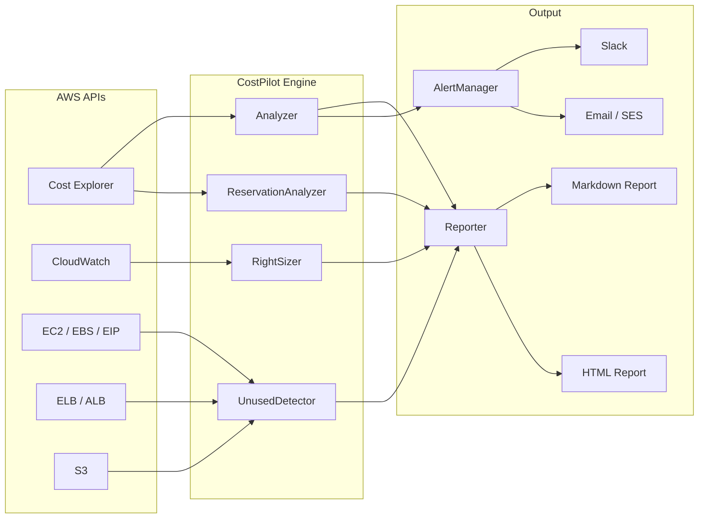

# CostPilot — Cloud Cost Optimization Engine


**CostPilot is an automated AWS cost optimization CLI that analyzes cloud spend, identifies rightsizing opportunities, detects unused resources, evaluates RI/Savings Plans coverage, and generates actionable HTML and Markdown reports — helping engineering teams cut infrastructure costs by 20–40% without sacrificing performance.**

---

## Architecture



## Features

| Category | What It Does | Typical Savings |
|----------|-------------|-----------------|
| **Cost Analysis** | 30/60/90-day spend breakdown by service, account, and region with trend detection and spike alerts | Visibility into 100% of spend |
| **Rightsizing** | EC2 & RDS recommendations based on CloudWatch CPU, memory, and network utilization | 15–30% compute savings |
| **Unused Resources** | Detects unattached EBS, idle ALBs, unassociated EIPs, empty S3 buckets, stopped EC2 >7 days, orphaned snapshots | $200–2,000+/mo recovered |
| **RI & Savings Plans** | Utilization tracking, coverage analysis, purchase recommendations with break-even calculations | 20–40% on committed workloads |
| **Reporting** | Dark-themed HTML and Markdown reports via Jinja2 templates | — |
| **Alerting** | AWS Budgets integration, Slack webhooks, and SES email alerts | Prevents cost overruns |
| **Forecasting** | Linear regression projections for next-month spend | Early warning on budget drift |

## CLI Commands

| Command | Description | Example |
|---------|-------------|---------|
| `costpilot analyze` | Run full cost analysis for a given period | `costpilot analyze --days 30` |
| `costpilot report` | Generate HTML or Markdown report | `costpilot report --format html -o report.html` |
| `costpilot unused` | Detect unused/idle AWS resources | `costpilot unused --all` |
| `costpilot watch` | Continuous monitoring with alerting | `costpilot watch --interval 3600 --alert-threshold 15` |
| `costpilot analyze --include-reservations` | Include RI/Savings Plans analysis | `costpilot analyze --days 90 --include-reservations` |

## Installation

```bash
git clone https://github.com/hunterspence/aws-cloud-portfolio.git
cd aws-cloud-portfolio/costpilot
pip install -e .
```

### Configuration

```bash
# Set AWS credentials
export AWS_PROFILE=production

# Optional: Slack alerts
export COSTPILOT_SLACK_WEBHOOK=https://hooks.slack.com/services/...

# Optional: SES alerts
export COSTPILOT_SES_SENDER=alerts@example.com
export COSTPILOT_SES_RECIPIENT=team@example.com
```

Or use `~/.costpilot/config.yaml`:

```yaml
aws_profile: production
alert_threshold_pct: 15
slack_webhook: https://hooks.slack.com/services/...
ses_sender: alerts@example.com
ses_recipients:
  - team@example.com
```

## Usage Examples

```bash
# Full cost analysis (last 30 days)
costpilot analyze --days 30

# Generate HTML + Markdown reports
costpilot report --format html --output report.html
costpilot report --format markdown --output report.md

# Detect unused resources
costpilot unused --all
costpilot unused --ebs --eip --ec2

# Watch mode (continuous monitoring)
costpilot watch --interval 3600 --alert-threshold 15
```

### Sample Output

```
CostPilot Cost Analysis — 2026-02-01 to 2026-02-20
====================================================

Total Spend:        $14,832.47
Projected Month:    $22,248.71
Month-over-Month:   +8.3%

Top Services:
  1. Amazon EC2           $6,241.18  (42.1%)
  2. Amazon RDS           $3,108.54  (21.0%)
  3. Amazon S3            $1,927.33  (13.0%)

⚠ Spike Detected: EC2 spend +34% on Feb 14 ($892 vs $665 avg)

Rightsizing Opportunities:     12 instances    ~$1,840/mo savings
Unused Resources Found:         8 resources    ~$420/mo waste
RI Coverage Gap:               23%             ~$2,100/yr opportunity
```

See [`sample-output/sample-report.md`](sample-output/sample-report.md) for a full report.

## Modules

| Module | File | Description |
|--------|------|-------------|
| **CLI** | `cli.py` | Click-based command interface with subcommands and options |
| **Analyzer** | `analyzer.py` | Cost Explorer queries, trend detection, spike alerting, projections |
| **RightSizer** | `rightsizer.py` | CloudWatch-driven EC2/RDS instance rightsizing recommendations |
| **UnusedDetector** | `unused.py` | Scans for unattached EBS, idle ALBs, unassociated EIPs, orphaned snapshots |
| **ReservationAnalyzer** | `reservations.py` | RI/Savings Plans utilization, coverage gaps, purchase recommendations |
| **Reporter** | `reporter.py` | Jinja2-based HTML and Markdown report generation |
| **AlertManager** | `alerts.py` | Slack webhook, SES email, and AWS Budgets alert integration |
| **Models** | `models.py` | Pydantic data models for cost records, recommendations, alerts |
| **Config** | `config.py` | YAML/env configuration loading and validation |

## AWS Permissions

Minimum IAM policy required:

```json
{
  "Version": "2012-10-17",
  "Statement": [
    {
      "Effect": "Allow",
      "Action": [
        "ce:GetCostAndUsage",
        "ce:GetReservationUtilization",
        "ce:GetSavingsPlansUtilization",
        "ce:GetReservationCoverage",
        "ce:GetSavingsPlansCoverage",
        "cloudwatch:GetMetricStatistics",
        "cloudwatch:ListMetrics",
        "ec2:DescribeInstances",
        "ec2:DescribeVolumes",
        "ec2:DescribeAddresses",
        "ec2:DescribeSnapshots",
        "elasticloadbalancing:DescribeLoadBalancers",
        "elasticloadbalancing:DescribeTargetHealth",
        "s3:ListAllMyBuckets",
        "s3:GetBucketLocation",
        "budgets:ViewBudget",
        "ses:SendEmail"
      ],
      "Resource": "*"
    }
  ]
}
```

## Testing

```bash
# Run all tests
pytest tests/ -v

# Run with coverage
pytest tests/ --cov=costpilot --cov-report=term-missing

# Run specific test module
pytest tests/test_analyzer.py -v
```

## License

MIT
