# CostPilot — Cloud Cost Optimization Engine


CostPilot is an automated AWS cost optimization CLI that analyzes your cloud spend, recommends EC2/RDS rightsizing based on CloudWatch metrics, detects unused resources (unattached EBS, idle ALBs, orphaned snapshots, unassociated EIPs), evaluates RI/Savings Plans coverage, and generates dark-themed HTML and Markdown reports — with Slack and email alerting built in.

---

## Architecture

```mermaid
graph LR
    subgraph AWS["☁️ AWS APIs"]
        CE[Cost Explorer]
        CW[CloudWatch]
        EC2[EC2 / EBS / EIP]
        ELB[ELB / ALB]
        S3[S3]
    end

    subgraph Engine["⚙️ CostPilot Engine"]
        A[Analyzer]
        RS[RightSizer]
        UD[UnusedDetector]
        RA[ReservationAnalyzer]
    end

    subgraph Output["📊 Output"]
        R[Reporter]
        MD[Markdown Report]
        HTML[HTML Report]
        AM[AlertManager]
        Slack[Slack]
        Email[Email / SES]
    end

    CE --> A
    CW --> A
    CW --> RS
    EC2 --> RS
    EC2 --> UD
    ELB --> UD
    S3 --> UD

    A --> R
    RS --> R
    UD --> R
    RA --> R

    R --> MD
    R --> HTML

    A --> AM
    AM --> Slack
    AM --> Email
```



## Features

| Category | What It Does | Typical Savings |
|----------|-------------|-----------------|
| **Cost Analysis** | 30/60/90-day spend breakdown by service, account, region with trend detection and spike alerts | — |
| **Rightsizing** | EC2 & RDS recommendations based on CPU/memory/network utilization | ~$400–2,000/mo |
| **Unused Resources** | Unattached EBS, idle ALBs, unassociated EIPs, empty S3 buckets, stopped EC2 >7d, orphaned snapshots | ~$100–500/mo |
| **RI & Savings Plans** | Utilization tracking, coverage analysis, purchase recommendations with break-even math | ~$2,000–10,000/yr |
| **Cost Projections** | Linear regression forecasting for next-month spend | — |
| **Reporting** | Dark-themed HTML + Markdown reports via Jinja2 templates | — |
| **Alerting** | AWS Budgets integration, Slack webhooks, SES email alerts | — |

## CLI Commands

| Command | Description | Example |
|---------|-------------|---------|
| `costpilot analyze` | Full cost analysis for a given period | `costpilot analyze --days 30` |
| `costpilot report` | Generate HTML or Markdown report | `costpilot report --format html -o report.html` |
| `costpilot unused` | Detect unused/idle resources | `costpilot unused --all` |
| `costpilot watch` | Continuous monitoring with alerting | `costpilot watch --interval 3600 --alert-threshold 15` |
| `costpilot analyze --include-reservations` | Include RI/Savings Plans analysis | `costpilot analyze --days 90 --include-reservations` |

## Installation

```bash
git clone https://github.com/hunterspence/aws-cloud-portfolio.git
cd aws-cloud-portfolio/costpilot
pip install -e .
```

**Requirements:** Python 3.11+, valid AWS credentials with appropriate IAM permissions.

## Configuration

```bash
# AWS credentials
export AWS_PROFILE=production

# Optional: Slack alerts
export COSTPILOT_SLACK_WEBHOOK=https://hooks.slack.com/services/...

# Optional: SES email alerts
export COSTPILOT_SES_SENDER=alerts@example.com
export COSTPILOT_SES_RECIPIENT=team@example.com
```

Or use `~/.costpilot/config.yaml`:

```yaml
aws_profile: production
alert_threshold_pct: 15
slack_webhook: https://hooks.slack.com/services/...
ses_sender: alerts@example.com
ses_recipients:
  - team@example.com
```

## Usage Examples

### Full Analysis

```bash
$ costpilot analyze --days 30

CostPilot Cost Analysis — 2026-02-01 to 2026-02-20
====================================================

Total Spend:        $14,832.47
Projected Month:    $22,248.71
Month-over-Month:   +8.3%

Top Services:
  1. Amazon EC2           $6,241.18  (42.1%)
  2. Amazon RDS           $3,108.54  (21.0%)
  3. Amazon S3            $1,927.33  (13.0%)

⚠ Spike Detected: EC2 spend +34% on Feb 14 ($892 vs $665 avg)

Rightsizing Opportunities:     12 instances    ~$1,840/mo savings
Unused Resources Found:         8 resources    ~$420/mo waste
RI Coverage Gap:               23%             ~$2,100/yr opportunity
```

### Unused Resource Detection

```bash
$ costpilot unused --all

Found 8 unused resources — $148.45/mo waste

  EBS Volumes (3)         $48.00/mo
  Elastic IPs (2)          $7.20/mo
  Load Balancers (1)      $16.20/mo
  Stopped Instances (1)   $40.00/mo
  Old Snapshots (2)       $37.05/mo
```

### Generate Reports

```bash
$ costpilot report --format html --output report.html
✓ HTML report saved to report.html

$ costpilot report --format markdown --output report.md
✓ Markdown report saved to report.md
```

## Sample Report

See the full generated report: **[sample-output/sample-report.md](sample-output/sample-report.md)**

Key highlights from a sample run:

| Metric | Value |
|--------|-------|
| Total Spend (30 days) | $4,827.53 |
| Rightsizing Savings | $434.35/mo |
| Unused Resource Waste | $148.45/mo |
| **Total Potential Savings** | **$1,247.80/mo** |

## Modules

| Module | File | Description |
|--------|------|-------------|
| **CLI** | `cli.py` | Click-based command interface with subcommands |
| **Analyzer** | `analyzer.py` | Cost Explorer queries, trend detection, spike alerts |
| **RightSizer** | `rightsizer.py` | CloudWatch-driven EC2/RDS rightsizing recommendations |
| **UnusedDetector** | `unused.py` | Scans for idle EBS, EIPs, ALBs, stopped EC2, orphaned snapshots |
| **ReservationAnalyzer** | `reservations.py` | RI/Savings Plans utilization, coverage, and purchase recommendations |
| **Reporter** | `reporter.py` | Jinja2-based HTML and Markdown report generation |
| **AlertManager** | `alerts.py` | AWS Budgets, Slack webhook, and SES email alerting |
| **Models** | `models.py` | Pydantic data models for analysis results |
| **Config** | `config.py` | YAML/env configuration loader |

## AWS Permissions

Minimum IAM policy required:

```json
{
  "Version": "2012-10-17",
  "Statement": [
    {
      "Effect": "Allow",
      "Action": [
        "ce:GetCostAndUsage",
        "ce:GetReservationUtilization",
        "ce:GetSavingsPlansUtilization",
        "ce:GetReservationCoverage",
        "ce:GetSavingsPlansCoverage",
        "cloudwatch:GetMetricStatistics",
        "cloudwatch:ListMetrics",
        "ec2:DescribeInstances",
        "ec2:DescribeVolumes",
        "ec2:DescribeAddresses",
        "ec2:DescribeSnapshots",
        "elasticloadbalancing:DescribeLoadBalancers",
        "elasticloadbalancing:DescribeTargetHealth",
        "s3:ListAllMyBuckets",
        "s3:GetBucketLocation",
        "rds:DescribeDBInstances",
        "budgets:DescribeBudgets",
        "ses:SendEmail"
      ],
      "Resource": "*"
    }
  ]
}
```

## Testing

```bash
# Run all tests
pytest tests/ -v

# Run with coverage
pytest tests/ --cov=costpilot --cov-report=term-missing

# Run specific module tests
pytest tests/test_analyzer.py -v
pytest tests/test_rightsizer.py -v
pytest tests/test_unused.py -v
```

## License

MIT
