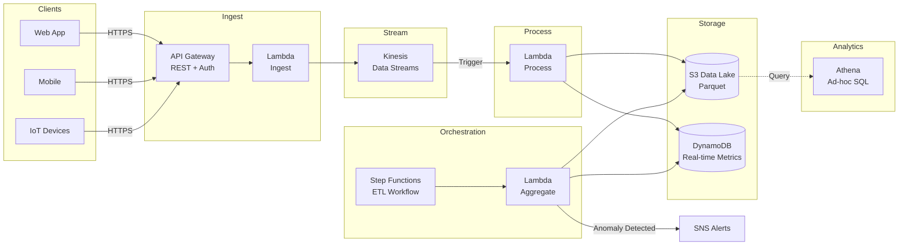
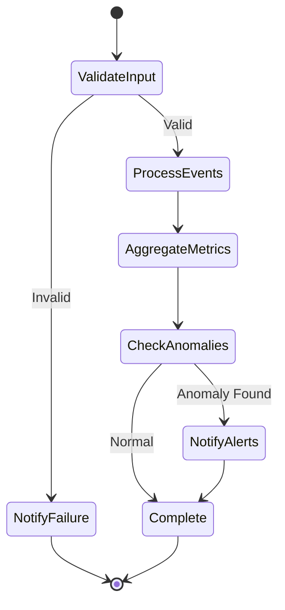

# EventStream — Serverless Real-Time Analytics Pipeline


A production-grade serverless real-time analytics pipeline that ingests, processes, and aggregates streaming events at scale using AWS managed services. Events flow through API Gateway into Kinesis Data Streams, get transformed into Parquet and stored in an S3 data lake, with Step Functions orchestrating hourly aggregations, Z-score anomaly detection, and SNS alerting — all defined as Infrastructure as Code via AWS SAM with sub-second latency and automatic scaling from zero to millions of events.

---

## Architecture



### Step Functions ETL Workflow



---

## Features

- **Real-Time Ingestion** — API Gateway + Lambda validates and enriches events, writes to Kinesis
- **Stream Processing** — Kinesis-triggered Lambda transforms events to Parquet, stores in S3 data lake
- **Hourly Aggregation** — Step Functions orchestrates scheduled rollups with anomaly detection
- **Anomaly Detection** — Z-score based detection on event volumes and latency with SNS alerting
- **Data Lake** — Partitioned Parquet on S3, queryable via Athena (Hive-style partitioning)
- **Real-Time Metrics** — DynamoDB stores latest metrics for dashboards
- **Infrastructure as Code** — Full AWS SAM template with least-privilege IAM
- **Observability** — Structured JSON logging, CloudWatch metrics, X-Ray tracing

---

## Components

| Component | Service | Purpose |
|-----------|---------|---------|
| Ingestion | API Gateway + Lambda | Event validation, enrichment, rate limiting |
| Streaming | Kinesis Data Streams (2 shards) | Durable ordered event stream with 24h retention |
| Processing | Lambda (Kinesis trigger) | Transform events → Parquet → S3, update DynamoDB |
| Data Lake | S3 | Hive-partitioned Parquet storage (`year/month/day/hour`) |
| Metrics | DynamoDB (on-demand) | Real-time metrics for dashboards |
| Analytics | Athena | Ad-hoc SQL queries on Parquet data |
| Orchestration | Step Functions | ETL workflow: validate → process → aggregate → alert |
| Aggregation | Lambda | Hourly rollups, Z-score anomaly detection |
| Alerting | SNS | Anomaly notifications via email/SMS/webhook |

---

## Data Flow

1. **Ingest** — Clients send events via HTTPS to API Gateway. The Ingest Lambda validates the payload against Pydantic schemas, enriches it with timestamps and metadata, and writes to Kinesis.
2. **Stream** — Kinesis Data Streams buffers events durably across 2 shards, providing ordered delivery and replay capability.
3. **Process** — A Kinesis-triggered Lambda reads batches, converts events to Parquet format, writes partitioned files to S3, and updates real-time counters in DynamoDB.
4. **Aggregate** — Step Functions runs hourly, invoking the Aggregate Lambda to compute rollups (counts, averages, percentiles) and run Z-score anomaly detection.
5. **Alert** — When anomalies are detected (spikes/drops in volume or latency), SNS publishes notifications.
6. **Query** — Athena provides ad-hoc SQL access to the entire data lake with partition pruning for fast, cost-effective analytics.

---

## Deployment

### Prerequisites

- AWS CLI configured (`aws configure`)
- AWS SAM CLI (`pip install aws-sam-cli`)
- Python 3.11+
- S3 bucket for SAM artifacts

### Deploy

```bash
# Build
sam build

# Deploy (guided first time)
sam deploy --guided

# Subsequent deploys
sam deploy
```

---

## Cost Estimate (per 1M events/month)

| Service | Configuration | Est. Cost |
|---------|---------------|-----------|
| API Gateway | 1M requests | $3.50 |
| Lambda (×3) | 1M invocations, 256 MB | $5.00 |
| Kinesis | 2 shards | $29.00 |
| S3 | 50 GB storage | $1.15 |
| DynamoDB | On-demand, 1M writes | $1.25 |
| Athena | 10 queries/day, 100 MB scanned | $0.50 |
| Step Functions | 1K executions | $0.03 |
| SNS | 1K notifications | $0.00 |
| **Total** | | **~$40/mo** |

> At low traffic, costs can be under **$5/mo** due to AWS Free Tier eligibility.

---

## Sample Athena Queries

```sql
-- Event counts by type for today
SELECT event_type, COUNT(*) as event_count, AVG(latency_ms) as avg_latency
FROM eventstream.events
WHERE year = '2026' AND month = '02' AND day = '20'
GROUP BY event_type
ORDER BY event_count DESC;

-- Hourly traffic trend
SELECT date_trunc('hour', event_time) AS hour, COUNT(*) AS events
FROM eventstream.events
WHERE year = '2026' AND month = '02'
GROUP BY 1 ORDER BY 1;

-- Top users by event volume
SELECT user_id, COUNT(*) AS events, COUNT(DISTINCT event_type) AS unique_types
FROM eventstream.events
WHERE year = '2026'
GROUP BY user_id
ORDER BY events DESC
LIMIT 20;

-- Anomaly investigation: latency spikes
SELECT event_type, source,
       AVG(latency_ms) AS avg_latency,
       APPROX_PERCENTILE(latency_ms, 0.99) AS p99_latency
FROM eventstream.events
WHERE year = '2026' AND month = '02' AND day = '20'
GROUP BY event_type, source
HAVING AVG(latency_ms) > 1000;
```

---

## Testing

```bash
# Run unit tests
python -m pytest tests/ -v

# Invoke ingest function locally
sam local invoke IngestFunction -e events/sample_event.json

# Start local API for integration testing
sam local start-api

# Send a test event
curl -X POST http://localhost:3000/events \
  -H "Content-Type: application/json" \
  -d '{
    "event_type": "page_view",
    "source": "web",
    "user_id": "usr_12345",
    "properties": {
      "page": "/dashboard",
      "referrer": "https://google.com",
      "duration_ms": 2500
    }
  }'
```

---

## Project Structure

```
eventstream/
├── template.yaml              # SAM infrastructure
├── samconfig.toml             # Deployment config
├── src/
│   ├── ingest/handler.py      # Event validation + Kinesis write
│   ├── process/handler.py     # Stream processing → Parquet → S3
│   ├── aggregate/handler.py   # Hourly rollups + anomaly detection
│   └── common/
│       ├── models.py          # Pydantic event schemas
│       └── config.py          # Configuration management
├── athena/
│   ├── create_tables.sql      # Table definitions
│   └── sample_queries.sql     # Example analytics queries
├── step-functions/
│   └── etl-workflow.json      # Step Functions definition
├── tests/
│   ├── test_ingest.py
│   └── test_process.py
└── events/
    └── sample_event.json
```

---

## License

MIT
