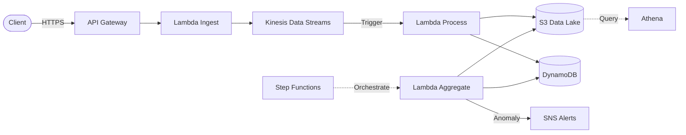
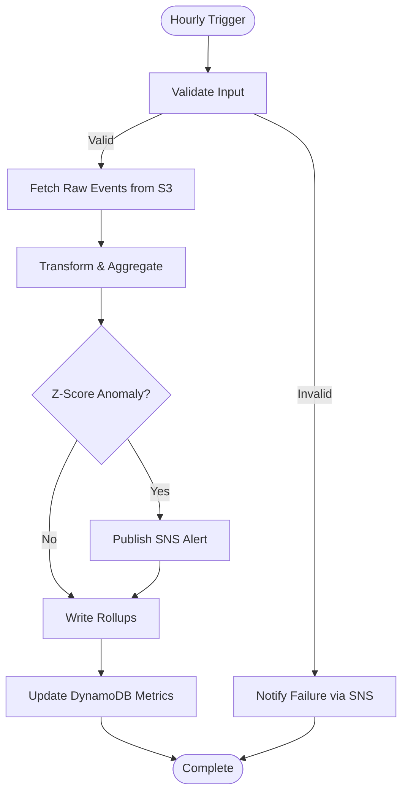

# ⚡ EventStream — Serverless Real-Time Analytics Pipeline


A production-grade serverless pipeline that ingests millions of real-time events through API Gateway, buffers them in Kinesis Data Streams, transforms to Parquet and lands them in an S3 data lake, maintains live counters in DynamoDB, runs hourly Step Functions ETL with Z-score anomaly detection, and fires SNS alerts — all defined as Infrastructure as Code via AWS SAM with sub-second latency and automatic scaling from zero.

---

## Architecture



### Step Functions ETL Workflow



---

## Features

- **Real-Time Ingestion** — API Gateway + Lambda validates events via Pydantic, enriches with metadata, writes to Kinesis
- **Stream Processing** — Kinesis-triggered Lambda converts events to Parquet, writes Hive-partitioned files to S3
- **Hourly ETL** — Step Functions orchestrates scheduled rollups with anomaly detection
- **Anomaly Detection** — Z-score analysis on event volumes and latency; automatic SNS alerting
- **Data Lake** — Partitioned Parquet on S3 (`year/month/day/hour`), queryable via Athena
- **Real-Time Metrics** — DynamoDB on-demand tables for live dashboards
- **Infrastructure as Code** — Full AWS SAM template with least-privilege IAM policies
- **Observability** — Structured JSON logging, CloudWatch metrics, X-Ray tracing

---

## Components

| Component | AWS Service | Purpose |
|-----------|-------------|---------|
| **Ingestion** | API Gateway + Lambda | Event validation, enrichment, rate limiting |
| **Streaming** | Kinesis Data Streams (2 shards) | Ordered durable event buffer, 24h retention |
| **Processing** | Lambda (Kinesis trigger) | Transform → Parquet → S3, update DynamoDB counters |
| **Data Lake** | S3 | Hive-partitioned Parquet storage |
| **Metrics** | DynamoDB (on-demand) | Real-time counters and gauges for dashboards |
| **Analytics** | Athena | Ad-hoc SQL over the data lake |
| **Orchestration** | Step Functions | ETL workflow: validate → aggregate → detect → alert |
| **Aggregation** | Lambda | Hourly rollups, Z-score anomaly detection |
| **Alerting** | SNS | Email / SMS / webhook notifications on anomalies |

---

## Deployment

### Prerequisites

- AWS CLI configured (`aws configure`)
- AWS SAM CLI (`pip install aws-sam-cli`)
- Python 3.11+

### Deploy

```bash
# Build all Lambda functions
sam build

# First-time guided deploy (creates samconfig.toml)
sam deploy --guided

# Subsequent deploys
sam deploy
```

### Tear Down

```bash
sam delete --stack-name eventstream
```

---

## Cost Estimate (per 1M events/month)

| Service | Configuration | Est. Cost |
|---------|---------------|-----------|
| API Gateway | 1M requests | $3.50 |
| Lambda (×3) | 1M invocations, 256 MB | $5.00 |
| Kinesis | 2 shards | $29.00 |
| S3 | ~50 GB Parquet | $1.15 |
| DynamoDB | On-demand, 1M writes | $1.25 |
| Athena | ~10 queries/day | $0.50 |
| Step Functions | ~720 executions | $0.03 |
| SNS | 1K notifications | $0.00 |
| **Total** | | **~$40/mo** |

> At low traffic, costs can be under **$5/mo** thanks to AWS Free Tier.

---

## Testing

```bash
# Unit tests
python -m pytest tests/ -v

# Invoke locally
sam local invoke IngestFunction -e events/sample_event.json

# Local API
sam local start-api

# Send a test event
curl -X POST http://localhost:3000/events \
  -H "Content-Type: application/json" \
  -d '{
    "event_type": "page_view",
    "source": "web",
    "user_id": "usr_12345",
    "properties": {
      "page": "/dashboard",
      "referrer": "https://google.com",
      "duration_ms": 2500
    }
  }'
```

---

## License

MIT
