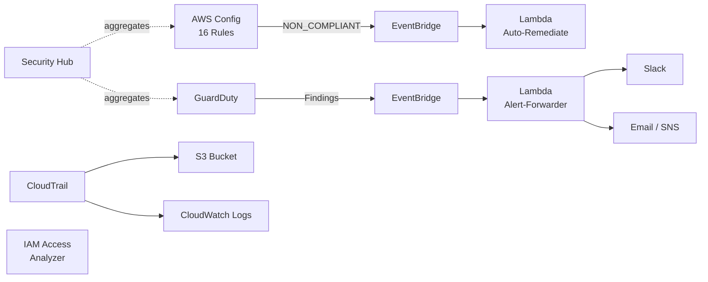

# 🔒 SentinelGuard — AWS Security & Compliance Baseline

[](https://terraform.io)
[](https://aws.amazon.com)
[](https://cisecurity.org)
[](https://csf.tools)
[](LICENSE)

SentinelGuard deploys a production-ready security baseline across your AWS account using Terraform. It provisions AWS Config with 16 managed rules mapped to CIS, AWS Foundational, and NIST frameworks, wires GuardDuty threat findings through EventBridge to a Lambda alert-forwarder that pushes to Slack and email, enables auto-remediation for common misconfigurations like public S3 buckets and unencrypted volumes, aggregates everything in Security Hub, and maintains a tamper-proof audit trail via CloudTrail — all in a single `terraform apply`.

---

## Architecture



---

## Compliance Frameworks

| Framework | Standard | Coverage |
|-----------|----------|----------|
| **CIS AWS Foundations** | v1.4 | IAM, logging, monitoring, networking |
| **AWS Foundational Security** | Best Practices v1.0 | Config rules, Security Hub checks |
| **NIST 800-53** | Rev 5 | Access control, audit, system protection |

---

## Config Rules (16)

| # | Rule | What It Checks |
|---|------|---------------|
| 1 | `S3_BUCKET_PUBLIC_READ_PROHIBITED` | No public read ACLs on S3 buckets |
| 2 | `S3_BUCKET_PUBLIC_WRITE_PROHIBITED` | No public write ACLs on S3 buckets |
| 3 | `S3_BUCKET_SSL_REQUESTS_ONLY` | S3 bucket policies enforce TLS |
| 4 | `ROOT_ACCOUNT_MFA_ENABLED` | Root account has MFA enabled |
| 5 | `IAM_ROOT_ACCESS_KEY_CHECK` | No access keys on root account |
| 6 | `MFA_ENABLED_FOR_IAM_CONSOLE_ACCESS` | Console users have MFA |
| 7 | `IAM_PASSWORD_POLICY` | Strong password policy enforced |
| 8 | `CLOUD_TRAIL_ENABLED` | CloudTrail is active |
| 9 | `CLOUD_TRAIL_LOG_FILE_VALIDATION_ENABLED` | Log file integrity validation on |
| 10 | `ENCRYPTED_VOLUMES` | EBS volumes are encrypted |
| 11 | `RDS_STORAGE_ENCRYPTED` | RDS storage encryption enabled |
| 12 | `VPC_FLOW_LOGS_ENABLED` | VPC flow logs are turned on |
| 13 | `INCOMING_SSH_DISABLED` | No unrestricted SSH (0.0.0.0/0 :22) |
| 14 | `RESTRICTED_INCOMING_TRAFFIC` | No wide-open ingress on high-risk ports |
| 15 | `CW_LOGGROUP_RETENTION_PERIOD_CHECK` | CloudWatch log groups have retention set |
| 16 | `MULTI_REGION_CLOUD_TRAIL_ENABLED` | CloudTrail covers all regions |

---

## Auto-Remediation Actions

| Finding | Remediation | Trigger |
|---------|-------------|---------|
| Public S3 bucket | Block public access | Config NON_COMPLIANT |
| Exposed IAM access keys | Deactivate key + notify | Config NON_COMPLIANT |
| Unencrypted EBS volume | Create encrypted snapshot, swap | Config NON_COMPLIANT |
| Public RDS instance | Disable public accessibility | Config NON_COMPLIANT |
| Compromised EC2 | Quarantine via security group | GuardDuty finding |

---

## Module Structure

| Module | Path | Purpose |
|--------|------|---------|
| **config-rules** | `modules/config-rules/` | 16 AWS Config managed rules + evaluation |
| **guardduty** | `modules/guardduty/` | Threat detection (S3 & EKS protection) |
| **securityhub** | `modules/securityhub/` | Findings aggregation & compliance scores |
| **cloudtrail** | `modules/cloudtrail/` | Multi-region trail, KMS encryption, S3 + CW delivery |
| **iam-analyzer** | `modules/iam-analyzer/` | External access analysis for IAM roles/policies |
| **auto-remediate** | `lambdas/auto-remediate/` | Remediation Lambda triggered by EventBridge |
| **alert-forwarder** | `lambdas/alert-forwarder/` | Slack & email notification Lambda |

---

## Deployment

```bash
cd sentinelguard

# 1. Initialise providers & modules
terraform init

# 2. Preview changes
terraform plan -var="environment=production" \
               -var="notification_email=security@company.com"

# 3. Apply
terraform apply -var="environment=production" \
                -var="notification_email=security@company.com"
```

---

## Teardown

```bash
# Destroy all SentinelGuard resources
terraform destroy -var="environment=production" \
                  -var="notification_email=security@company.com"
```

> **Note:** GuardDuty and Security Hub may require manual disabling in the console if they were enabled outside Terraform.

---

## License

MIT — See [LICENSE](LICENSE) for details.

*Built by [Hunter Spence](https://github.com/hunterspence) as part of the AWS Cloud Architecture Portfolio.*
