# 🛡️ SentinelGuard — AWS Security & Compliance Baseline


**SentinelGuard is an enterprise-grade security and compliance automation framework for AWS, delivering continuous posture management across CIS Benchmarks, AWS Foundational Best Practices, and NIST 800-53 controls — enforced entirely through Infrastructure as Code with real-time auto-remediation, centralized finding aggregation, and multi-channel alerting.**

---

## Architecture


---

## Compliance Framework Mapping

| Framework | Standard | Covered Controls | Mapped Rules |
|-----------|----------|-----------------|--------------|
| **CIS AWS Foundations v1.4** | Identity, Logging, Monitoring, Networking | 16 automated rules | All 16 Config rules below |
| **AWS Foundational Best Practices** | Security Hub standard | Encryption, access control, logging | S3 encryption, EBS encryption, RDS encryption, VPC flow logs, CloudTrail |
| **NIST 800-53** | AC, AU, CM, IA, SC families | Access control, audit, config mgmt | IAM password policy, MFA, CloudTrail, encrypted volumes, restricted ports |

---

## AWS Config Rules (16)

| # | Rule | Description | CIS | NIST |
|---|------|-------------|-----|------|
| 1 | `s3-bucket-public-read-prohibited` | Blocks S3 buckets from allowing public read access | ✅ | SC-7 |
| 2 | `s3-bucket-public-write-prohibited` | Blocks S3 buckets from allowing public write access | ✅ | SC-7 |
| 3 | `s3-bucket-ssl-requests-only` | Enforces SSL/TLS for all S3 bucket requests | ✅ | SC-8 |
| 4 | `root-account-mfa-enabled` | Ensures MFA is enabled on the root account | ✅ | IA-2 |
| 5 | `iam-root-access-key-check` | Verifies no access keys exist for the root account | ✅ | AC-6 |
| 6 | `mfa-enabled-for-iam-console-access` | Requires MFA for all IAM users with console access | ✅ | IA-2 |
| 7 | `iam-password-policy` | Enforces strong password policy (14+ chars, complexity, 90-day rotation) | ✅ | IA-5 |
| 8 | `cloudtrail-enabled` | Validates CloudTrail is active in the account | ✅ | AU-2 |
| 9 | `cloud-trail-log-file-validation-enabled` | Ensures CloudTrail log file integrity validation is on | ✅ | AU-9 |
| 10 | `encrypted-volumes` | Checks that all EBS volumes are encrypted | ✅ | SC-28 |
| 11 | `rds-storage-encrypted` | Validates encryption at rest for RDS instances | ✅ | SC-28 |
| 12 | `vpc-flow-logs-enabled` | Ensures VPC flow logs are enabled for network monitoring | ✅ | AU-12 |
| 13 | `restricted-ssh` | Blocks unrestricted SSH (port 22) ingress from 0.0.0.0/0 | ✅ | SC-7 |
| 14 | `restricted-common-ports` | Blocks public ingress on RDP (3389), MySQL (3306), MSSQL (1433), PostgreSQL (5432) | ✅ | SC-7 |
| 15 | `cloudwatch-log-group-encrypted` | Checks CloudWatch Log Group retention period configuration | ✅ | AU-11 |
| 16 | `multi-region-cloud-trail-enabled` | Ensures CloudTrail is recording in all AWS regions | ✅ | AU-2 |

---

## Auto-Remediation Actions

```mermaid
graph LR
    A["Non-Compliant<br/>Finding"] --> EB["EventBridge<br/>Rule"]
    EB --> L["Lambda:<br/>Auto-Remediate"]

    L --> R1["🪣 Block S3<br/>Public Access"]
    L --> R2["🔑 Deactivate<br/>Exposed IAM Keys"]
    L --> R3["💾 Encrypt<br/>EBS Volume"]
    L --> R4["🔒 Disable RDS<br/>Public Access"]
    L --> R5["🛑 Quarantine EC2<br/>via Security Group"]

    style A fill:#f85149,stroke:#da3633,color:#fff
    style L fill:#3fb950,stroke:#238636,color:#fff
```



| Trigger | Action | Effect |
|---------|--------|--------|
| Public S3 bucket detected | `PutPublicAccessBlock` | Enables all four public access block settings |
| Exposed IAM access key | `UpdateAccessKey` → Deactivate | Disables the compromised key and sends SNS alert |
| Unencrypted EBS volume | Create encrypted snapshot + swap | Snapshots volume, creates encrypted copy, notifies |
| Public RDS instance | `ModifyDBInstance` | Sets `PubliclyAccessible = false` |
| Compromised EC2 instance | Attach quarantine SG | Replaces security groups with zero-egress isolation SG |

---

## Module Structure

```
sentinelguard/
├── main.tf                            # Root orchestration — wires all modules
├── variables.tf                       # Input variables (environment, email, regions)
├── outputs.tf                         # Stack outputs (ARNs, dashboard URL)
├── providers.tf                       # AWS provider configuration
│
├── modules/
│   ├── config-rules/                  # AWS Config recorder + 16 CIS managed rules
│   ├── guardduty/                     # GuardDuty detector with S3 & EKS protection
│   ├── securityhub/                   # Security Hub with CIS & AWS standards enabled
│   ├── cloudtrail/                    # Multi-region trail with KMS + log validation
│   └── iam-analyzer/                  # IAM Access Analyzer for external access
│
├── lambdas/
│   ├── auto-remediate/handler.py      # Remediation engine (S3, IAM, EBS, RDS, EC2)
│   ├── alert-forwarder/handler.py     # Routes findings to Slack, email, PagerDuty
│   └── compliance-reporter/handler.py # Generates PDF/HTML compliance reports → S3
│
├── policies/
│   └── scp-guardrails.json            # Organization-level service control policies
│
└── dashboards/
    └── security-dashboard.json        # CloudWatch dashboard definition
```

---

## Deployment

### Prerequisites

- **Terraform** ≥ 1.6
- **AWS CLI** configured with admin credentials
- **Python** 3.11+ (Lambda runtime)

### Quick Start

```bash
git clone https://github.com/hunterspence/sentinelguard.git
cd sentinelguard

terraform init
terraform plan -var="environment=production" \
               -var="notification_email=security@company.com"
terraform apply -var="environment=production" \
                -var="notification_email=security@company.com"
```

### Configuration

```hcl
# terraform.tfvars
environment        = "production"
notification_email = "security@company.com"
slack_webhook_url  = "https://hooks.slack.com/services/..."
enable_guardduty   = true
enable_config      = true
enable_securityhub = true
approved_regions   = ["us-east-1", "us-west-2"]
```

---

## SCP Guardrails

Service Control Policies (SCPs) enforce organization-wide security invariants that **cannot be overridden** by any IAM principal, including account administrators:

| Guardrail | Effect |
|-----------|--------|
| **Deny CloudTrail Stop** | Prevents any principal from disabling CloudTrail logging |
| **Deny GuardDuty Disable** | Blocks deletion or suspension of GuardDuty detectors |
| **Deny Config Disable** | Prevents stopping the AWS Config recorder |
| **Deny Security Hub Disable** | Blocks disabling Security Hub |
| **Enforce S3 Encryption** | Denies `s3:PutObject` without server-side encryption |
| **Block S3 Public Access** | Prevents any S3 bucket policy allowing public access |
| **Region Restriction** | Limits resource creation to approved regions only |
| **Deny Root Access Keys** | Prevents creation of access keys for the root account |
| **Require IMDSv2** | Enforces Instance Metadata Service v2 for all EC2 instances |

---

## Security Dashboard

The CloudWatch Security Dashboard provides a single-pane-of-glass view across all security services:

- **Finding Trend** — Time-series widget tracking new vs. resolved findings over 30 days
- **Compliance Score** — Gauge showing percentage of passing Config rules
- **Remediation Activity** — Bar chart of auto-remediation Lambda invocations by type
- **GuardDuty Severity** — Heatmap of threat findings by severity (Low / Medium / High / Critical)
- **Top Non-Compliant Resources** — Table of resources with the most open findings

---

## Cost Estimate

| Service | Monthly Cost (est.) |
|---------|-------------------|
| AWS Config (16 rules) | ~$30 |
| GuardDuty | ~$35 |
| Security Hub | ~$15 |
| CloudTrail | ~$5 |
| Lambda executions | ~$2 |
| **Total** | **~$87/month** |

---

## License

MIT — See [LICENSE](LICENSE) for details.

---

*Built by [Hunter Spence](https://github.com/hunterspence) as part of the AWS Cloud Architecture Portfolio.*
